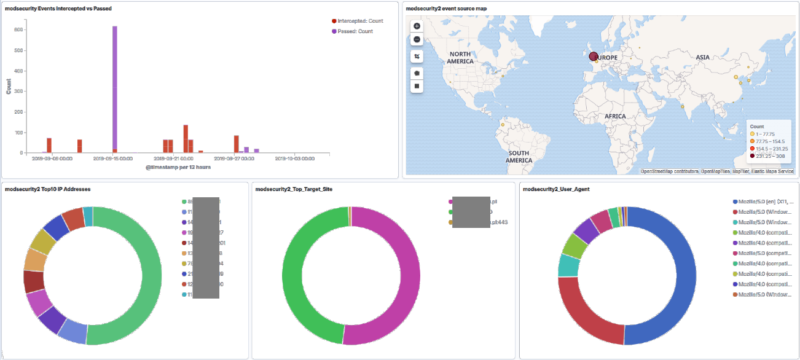

# Modsecurity-filebeat-kibana

## draft2

Dashboard Modsecurity2_Overview

Filebeat module for Modsecurity2 audit log + Kibana dashboards.

How to setup:
<h4> Elasticsarch and Kibana </h4>
 Install Elasticsearch 7.3.2 + Kibana 7.3.2 (older version could have problems with import the dashhoard)
 Configure firewall to allow access from filebeat host to elasticsearch service

<h4> Filebeat + module modsecurity2 installation </h4>
2. Configuration Filebeat (7.x recommended. Older versions may not work)
 
 copy filebeat/module/modsecurity2 into /usr/share/filebeat/module
 
 copy filebeat/etc/filebeat/modules.d/modsecurity2.yml.disabled into /etc/filebeat/modules.d
 
 configure /etc/filebeat/filebeat.yml (reference file placed in /etc/filebeat/filebeat.yml
    (change  hosts ["elasticsearch.local"] in section output.elastichsearch to elastichsarch instance listening from filebeat host
 
 enable Filebeat modsecurity2 module by command "filebeat modules enable modsecurity2" (or just rename /etc/filebeat/modules.d/modsecurity2.yml.disabled to /etc/filename/modules.d/modsecurity2.yml

<h4> Kibana configuration </h4>
3. Import objects into Kibana (via GUI: Management -> Saved Objects -> import):
   
 Modsecurity2_Overview.ndjson

Version is in Draft mode, present current status of the module.
TODO List:
1. Add TOP 10 Attacks intercepted
2. Add TOP 20 Rule ID hits ( + split messages into separate fields)
3. Add Modsecurity3 support (probably as a separate module)
4. Add DOC part (e.g. Modsecurity2 reference configuration) - ( Wiki ?)

